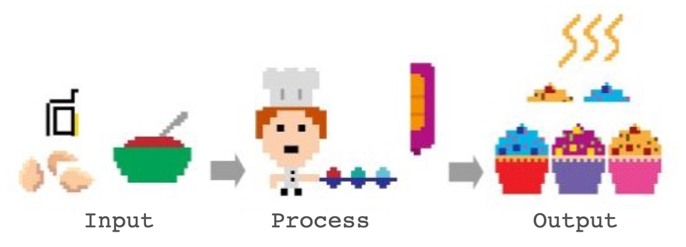
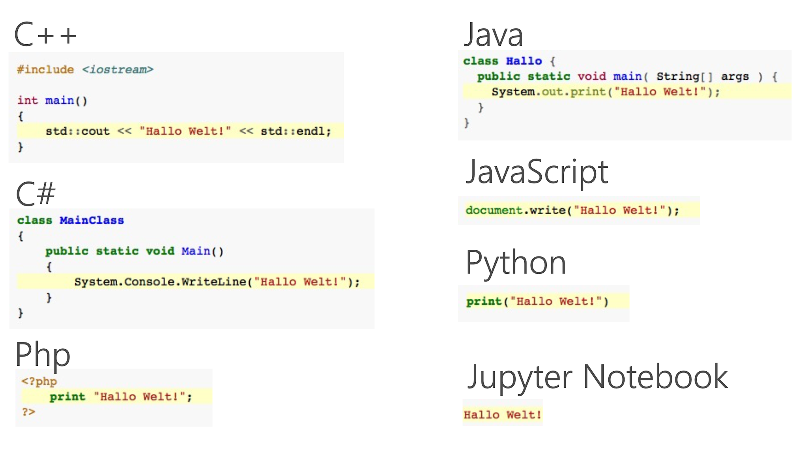
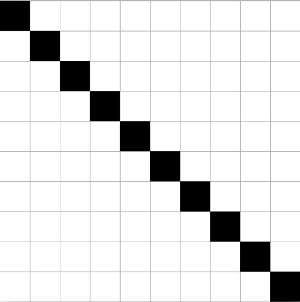
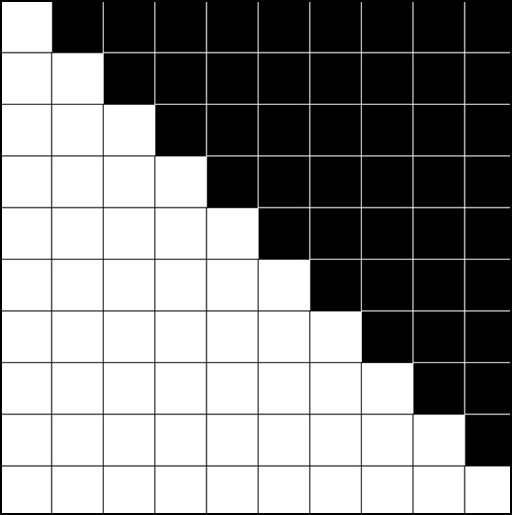

name: inverse
layout: true
class: center, middle, inverse
---

# Creative Coding For Beginners

#### - Programming -

<br />
### Prof. Dr. Lena Gieseke | l.gieseke@filmuniversitaet.de  

#### Film University Babelsberg KONRAD WOLF


---
layout:false

.header[Programming]

## Become a Better You 😀


Practice a systematic approach to problem solving

--

* …reflect and come up with a plan
* …divide and conquer
* …start with what you know
* …reformulate
* …build a healthy frustration tolerance and trust the process

--

<br />
In combination with
* Using your intuition and sensibilities, experiment!

???

## Become a Better You 😀

.left-even[
* You are learning a completely new skill
* You don’t know your approach yet
]

.right-even[ .imgref[[tattly](https://tattly.com/products/love-yourself)]]

---


.header[Programming]

## But I Hate Maths… 😳

* Programming in itself has nothing to do with maths  
    * Many programmers never use any maths at all
    * Certain applications might need maths, such as graphics and sound

--

* Programming is more like Sudoku
    * Solving one step at a time
    * Each step give hints for the next one

--

* Divide a problem into manageable sub-steps


---
.header[Programming]

## Like Writing a Recipe



???

1. Write a recipe from scratch
2. Start with another recipe as basis
3. Use a can

* What is Programming?
* To Command!

* Give commands to the computer
    * *Do this, then do that…*
    * *If this is true, do this; otherwise do that…*
    * *Do this 10 times…*
    * *Do this as long as…*


---
## Programming

You need to learn

--

1. Syntax

--

2. Algorithms

---
.header[Programming]

## Syntax

> The syntax of a programming language is the formal set of rules that defines how symbols, keywords, and structures must be arranged to form valid instructions that a computer can interpret.

--

```js
for (let i = 0; i <= 100; i++) {

    circle(i, i, 10);
}

```

---
.header[Programming | Syntax]

## Hello World

--

.center[  .imgref[[[wiki]](https://de.wikipedia.org/wiki/Liste_von_Hallo-Welt-Programmen/Höhere_Programmiersprachen#Java)]]


.header[What Are Programming Languages? | Algorithms]

## Hello World 👋🏻

### But Why?

* Tradition
* First used by Brian Kernighan, 1974 in the Bell Laboratories
* http://helloworldcollection.de
    * 567 Hello World programs

???


[[wikipedia]](https://de.wikipedia.org/wiki/Liste_von_Hallo-Welt-Programmen/H%C3%B6here_Programmiersprachen)


---
.header[Programming]

## Algorithm

An algorithm defines a list of steps to complete a task.

--
<br />
> […] an algorithm is a set of instructions, **typically to solve a class of problems** or perform a 
> computation.


--

<br />

> Algorithms are **unambiguous** specifications for performing calculation, data processing, automated reasoning, and other tasks.


---
.header[Programming]

## Algorithm

*Give instructions for cleaning the dishes.*

--
.left-even[
* With what are we working?
    * Inputs, data
* What is the process?
]

--
.right-even[  .imgref[[[source]](https://www.montessoriprivateacademy.com/wp-content/uploads/2015/11/montessori-washing-dishes.png)]]


???

* (plate, sponge, water, tap, soap, dirt)


.task[TASK:]  


## Hello World in p5.js?

p5.js is optimized for designer and artists to develop graphics, sound and interaction.


* Input: Program Code
* Output: Graphics


```js

function setup() {
    createCanvas(100, 100);
    background(255);
}

function draw() {
    point(50, 50);
}
```


* Show [Sketch](https://openprocessing.org/sketch/1011532)


[[1]](https://de.wikipedia.org/wiki/Liste_von_Hallo-Welt-Programmen/H%C3%B6here_Programmiersprachen)


---
template:inverse

# Algorithmic Thinking


???
   

* https://editor.p5js.org/legie/sketches/ZMRephHbg

* For a better understanding of the grid structure and also of operators, here a couple of examples.

---

## Algorithmic Thinking Examples

*How can you control the fill command to create the following examples?*

.center[]

---
.header[2D Loops]

```js
// https://editor.p5js.org/legie/sketches/lWJGIhhtI
function draw() {

    // Nested loop to run over all pixels of the canvas
    for (let y = 0; y < canvasSize; y+=stepSize) {
        for (let x = 0; x < canvasSize; x+=stepSize) {

            fill(255);
            // Changing the fill color
            // only for the cells on the
            // diagonal
            if ( y == x) {
                fill(0);
            }

            rect(x, y, stepSize, stepSize);
        }
    }
}
```

---


### Algorithmic Thinking Examples

.center[]

---


```js
// https://editor.p5js.org/legie/sketches/5x1bAs66K

function draw() {

    for (let y = 0; y < canvasSize; y+=stepSize) {
        for (let x = 0; x < canvasSize; x+=stepSize) {

            stroke(0);
            fill(255);

            if (x > y) {
                stroke(255);
                fill(0);
            }

            rect(x, y, stepSize, stepSize);
        }
    }
}
```


---

### Algorithmic Thinking Examples

.center[]

???
   

* The overall logic to create a checkerboard is to fill every other cell black and to shift that every other row. 

* You could also say that in the even rows (meaning the 0., 2., 4. row...), the even columns (meaning the 0., 2., 4. column...) should be black, and in the uneven rows, the uneven cells should be black.

* You can identify even numbers with the modulo operator.


---

### Algorithmic Thinking Examples

.left-even[]

<br /><br />

```js
         col 0   col 1   col 2   col 3
row 0:    0       1       0       1
row 1:    1       0       1       0
row 2:    0       1       0       1
row 3:    1       0       1       0
```

???
   

* The overall logic to create a checkerboard is to fill every other cell black and to shift that every other row. 

* You could also say that in the even rows (meaning the 0., 2., 4. row...), the even columns (meaning the 0., 2., 4. column...) should be black, and in the uneven rows, the uneven cells should be black.

* You can identify even numbers with the modulo operator.


---
template:inverse

### Syntax

## The Modulo Operator

---


## The Modulo Operator

--

The [modulo](https://www.computerhope.com/jargon/m/modulo.htm) operator returns for a division with a whole number the rest of that division:

```js
// Pseudo Code
 5 / 2 is 2 with rest 1
 8 / 2 is 4 with rest 0
 6 / 3 is 2 with rest 0
30 / 9 is 3 with rest 3
```
--
```
 5 % 2 = 1  
 8 % 2 = 0  
 6 % 3 = 0  
30 % 9 = 3  

```


???

```
5 / 2 is 2 (the quotient) with rest 1  

x / y is quotient q with rest r
x = q * y + r
```

---


## The Modulo Operator

This comes in handy when testing for even numbers:

--

```js
let number = 7;

if (number % 2 == 0) {

    print("even");
}
```


---
```js
// https://editor.p5js.org/legie/sketches/_NHk4arDR
function draw() {

    for (let y = 0; y < canvasSize; y += stepSize) {
        for (let x = 0; x < canvasSize; x += stepSize) {
            fill(255);

            // We need to divide by stepSize
            // to get the indices
            let row = y / stepSize;
            let column = x / stepSize;

            if ( ((row % 2 == 0) && (column % 2 == 0)) ||
                 ((row % 2 != 0) && (column % 2 != 0)) ) {

                    fill(0);
            } 
            rect(x, y, stepSize, stepSize);
        }
    }
}
```


???
* In our example, we can not work directly with the pixel coordinates, as by adding an even `stepSize` for the grid, we only have even pixel coordinates, such as 0, 100, 200,... 
* We need to divide the coordinates by `stepSize` to get the indices of the cells, with which we then want to do the modulo operation. 

---
```js
// https://editor.p5js.org/legie/sketches/_NHk4arDR
function draw() {

    for (let y = 0; y < canvasSize; y += stepSize) {
        for (let x = 0; x < canvasSize; x += stepSize) {
            fill(255);

            // We need to divide by stepSize
            // to get the indices
            let row = y / stepSize;
            let column = x / stepSize;

            if ((row + column) % 2 == 0) {
                fill(0);
            }
            rect(x, y, stepSize, stepSize);
        }
    }
}
```

---

### Algorithmic Thinking Examples


`(row + column) % 2` produces:

```js
         col 0   col 1   col 2   col 3
row 0:   0+0=0   0+1=1   0+2=2   0+3=3
row 1:   1+0=1   1+1=2   1+2=3   1+3=4
row 2:   2+0=2   2+1=3   2+2=4   2+3=5
row 3:   3+0=3   3+1=4   3+2=5   3+3=6
```

???

The reason it works: an even and an odd number always sum to odd, and two evens or two odds always sum to even. So the sum flips parity with every step in either direction.

Think about what row + column does as you move through the grid:

* move one step right → column increases by 1, so the sum increases by 1
* move one step down → row increases by 1, so the sum increases by 1
The sum changes by 1 with every step in either direction. And % 2 on a value that keeps increasing by 1 produces exactly: 0, 1, 0, 1...

So `(row + column) % 2` alternates with every step horizontally and every step vertically — which is exactly the checkerboard behavior we need.

```
row+col:  0  1  2  3       % 2:  0  1  0  1
          1  2  3  4              1  0  1  0
          2  3  4  5              0  1  0  1
          3  4  5  6              1  0  1  0
```


---
template:inverse 

# *The End*

### Prof. Dr. Lena Gieseke | l.gieseke@filmuniversitaet.de  

#### Film University Babelsberg KONRAD WOLF

???

[ccfb_ss26_09_images_slides](ccfb_ss26_09_images_slides.html)

