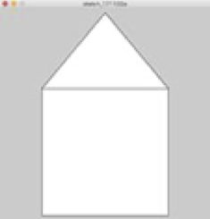
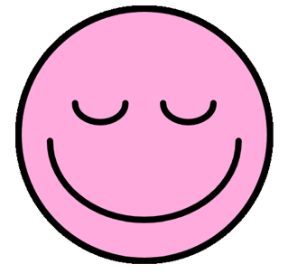
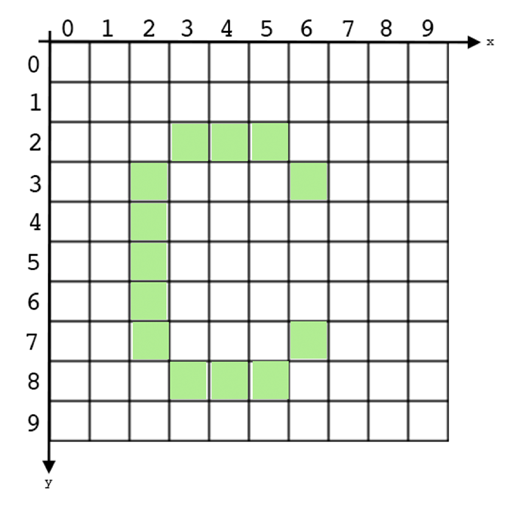
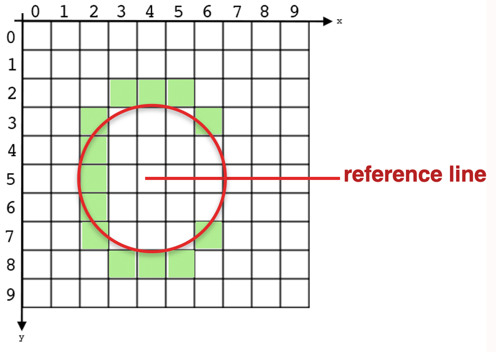
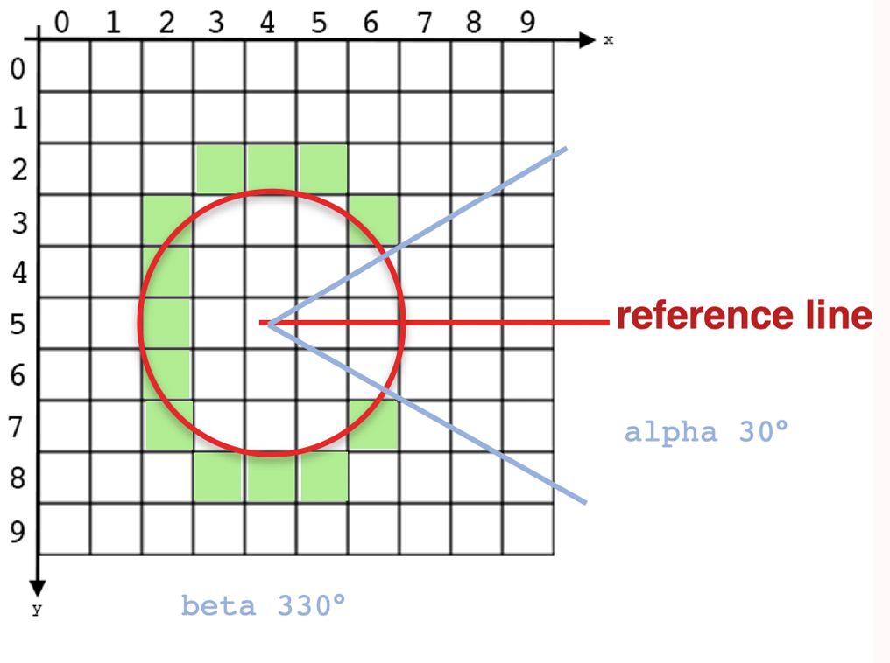
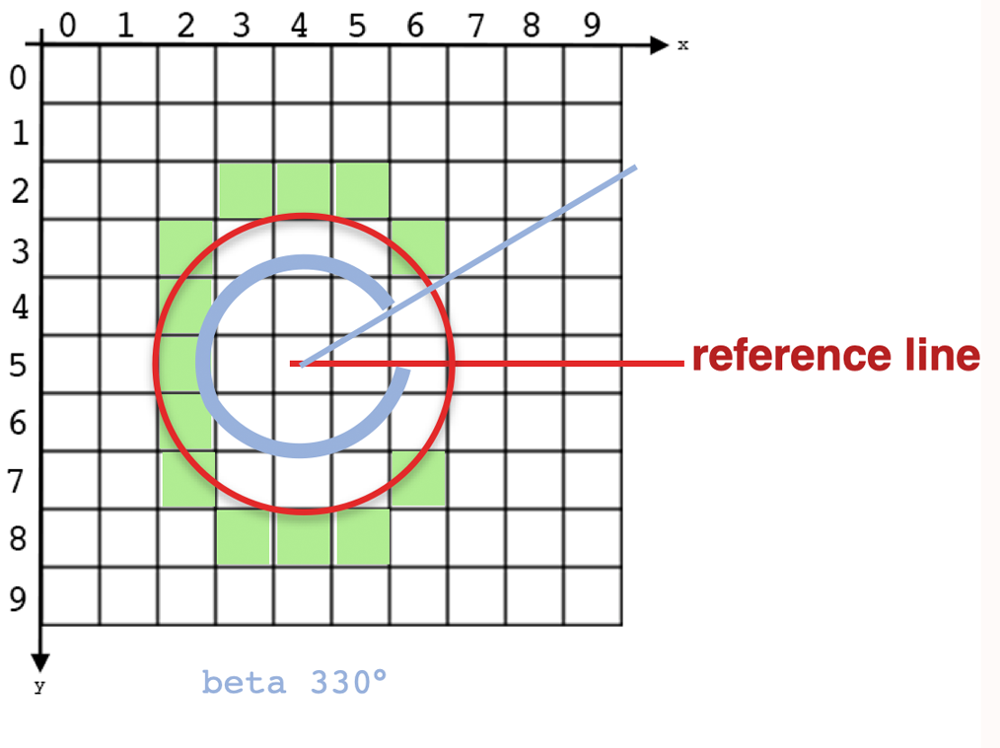
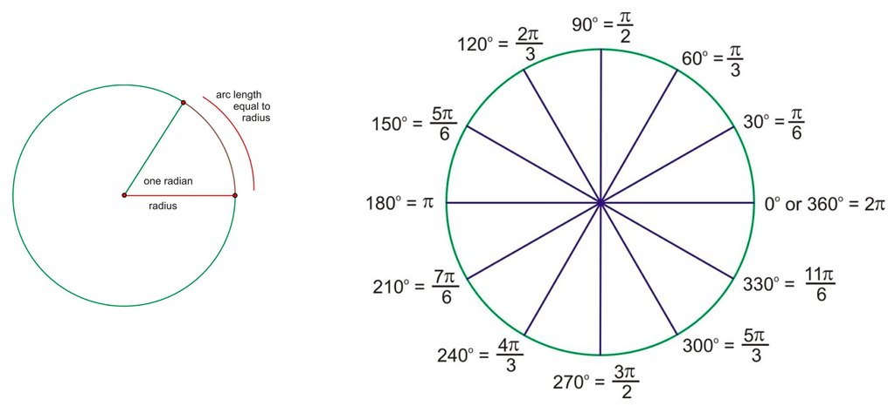
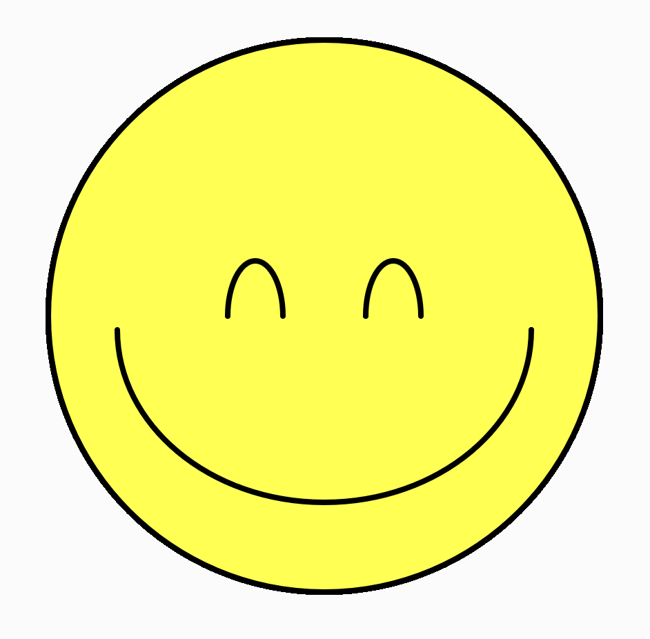

name: inverse
layout: true
class: center, middle, inverse
---

# Creative Coding For Beginners

#### - Session 02 -

<br />
### Prof. Dr. Lena Gieseke | l.gieseke@filmuniversitaet.de  

#### Film University Babelsberg KONRAD WOLF


---
layout:false

## Session 2

* Recap Session 1
* Exercise

--

* Program Flow & Interaction
    * *mouse pressed*, *key pressed*

--
* Conditionals
    * *if [...] happens, then...*
  

--
* Variables
    * *store values*


--


Some follow along coding...


---


## Recap Session 1

--

* Setup

--
    * JavaScript, p5.js

--

* Commands

--
    * Commands are calling functions

--
    * Functions must be defined somewhere 
  
```js
function myname() {

}
```

---


## Recap Session 1

* Setup
    * JavaScript, p5.js
* Commands
    * Commands are calling functions
    * Functions must be defined somewhere 
* System Loop

--
    * `setup(){}`: Called once upon starting the program
    * `draw(){}`: Called 60 times per second


---

## Recap Session 1

* Drawing

--
    * Coordinate System

--
    * Shape commands
        * `rect()`, `cricle()`, etc.

--
* Coloring

--
    * RGB

--
    * Active until changed or deactivated

--
* Comments

--
    * `//`, `/* */`


---
.header[Exercises Session 1]
## Task 01.03 - Motivation

Think about it why you want to learn creative coding:
* *What would you like to achieve with it?*
* *What could be an interesting project for you?*

???


---
.header[Exercises Session 1]
## Task 01.04 - Drawing

---
.header[Exercises Session 1]
## Task 01.04.01 - Drawing

* Draw the following house by *combining* shapes 

.center[]

???
* rect + triangle
* https://p5js.org/reference/p5/rect/
* https://p5js.org/reference/p5/triangle/

---
.header[Exercises Session 1]
## Task 01.04.01 - Drawing

```js
function setup() {
  createCanvas(400, 400);
}

function draw() {
  background(220);

  
  rect(100, 200, 200, 200);
  triangle(100, 200, 300, 200, 200, 100);
}
```

---
.header[Exercises Session 1]
## Task 01.04.02 - Drawing

* Draw the same house with `beginShape` and `endShape` 

.center[]

???
* https://p5js.org/reference/p5/beginShape/


---
.header[Exercises Session 1]
## Task 01.04.02 - Drawing

```js
function setup() {
  createCanvas(400, 400);
}

function draw() {
  background(220);
  beginShape();
    vertex(100, 200);
    vertex(100, 400);
    vertex(300, 400);
    vertex(300, 200);
    vertex(100, 200);
    vertex(200, 100);
    vertex(300, 200);
  endShape();
}
```


---
.header[Exercises Session 1]
## Task 01.04.03 - Drawing

* Draw a smiley with simple shapes   
* For this task, you will need to have a look at the reference for drawing an [**arc**](https://p5js.org/reference/p5/arc/)  

.center[]

???

* https://p5js.org/reference/p5/arc/

```js
function setup() {
  createCanvas(500, 500);
  strokeWeight(4);
}

function draw() {
  fill(255, 255, 0);
  ellipse(250, 250, 400, 400);

  //Eyes
  arc(200, 250, 40, 80, radians(180), radians(360));
  arc(300, 250, 40, 80, radians(180), radians(360));

  // Mouth
  arc(250, 260, 300, 250, 0, radians(180));
}
```


---
.header[Exercises Session 1 | Task 01.04.03 - Drawing]

## Arc 🤓

Drawing arcs is an example for needing a tiny bit of mathematical understanding.

---
.header[Exercises Session 1 | Task 01.04.03 - Drawing]

## Arc 🤓

```js
arc(x, y, width, height, alpha, beta);
```

.left-even[
Arguments:

* Center `(x1, y1)`
* `width`
* `height`
* Angle where to start `alpha`
* Angle where to end `beta`
]

.right-even[]

---
.header[Exercises Session 1 | Task 01.04.03 - Drawing]

### Arc 🤓

```js
arc(x, y, width, height, alpha, beta);
```

.left-even[
Arguments:

* Center `(x1, y1)`
* `width`
* `height`
* Angle where to start `alpha`
* Angle where to end `beta`
]

.right-even[]

Angles are measured in reference to a line starting at the center, running to the right, clock-wise.

---
.header[Exercises Session 1 | Task 01.04.03 - Drawing]

### Arc 🤓

```js
arc(x, y, width, height, alpha, beta);
```

.left-even[
Arguments:

* Center `(x1, y1)`
* `width`
* `height`
* Angle where to start `alpha`
* Angle where to end `beta`
]

.right-even[]

Angles are measured in reference to a line starting at the center, running to the right, clock-wise.

---
.header[Exercises Session 1 | Task 01.04.03 - Drawing]

### Arc 🤓

```js
arc(x, y, width, height, alpha, beta);
```

.left-even[
Arguments:

* Center `(x1, y1)`
* `width`
* `height`
* Angle where to start `alpha`
* Angle where to end `beta`
]

.right-even[]

Angles are measured in reference to a line starting at the center, running to the right, clock-wise.

---
.header[Exercises Session 1 | Task 01.04.03 - Drawing]

## Arc 🤓

```js
arc(x, y, width, height, alpha, beta);
```

.left-even[
Arguments:

* Center `(x1, y1)`
* `width`
* `height`
* Angle where to start `alpha`
* Angle where to end `beta`
]

.right-even[]


**Angles are in radians! `360°` are `2PI`**


---
.header[Exercises Session 1 | Task 01.04.03 - Drawing | Arc 🤓]

### Degrees vs. Radians

.center[]

You don't really have to understand what radians are. You just need to know how to use command with radians.


???
  

* Radians are alternate units used to measure angles. Just as it sounds, a radian is based on the radius of a circle. One radian (abbreviated rad) is the angle created by bending the radius length around the arc of a circle. Because a radian is based on an actual part of the circle rather than an arbitrary division, it is a much more natural unit of angle measure and often used for creating graphics. [[2]](https://www.ck12.org/book/CK-12-Trigonometry-Concepts/section/2.1)

---
.header[Exercises Session 1 | Task 01.04.03 - Drawing | Arc 🤓]

## Degrees vs. Radians

**Angles are in radians: `360°` are `2PI`**  

<br />

* `180°` are `PI`
* `90°` are `PI / 2`
* `60°` are `PI / 3`
* `30°` are `PI / 6`

--

Radians are often expressed in relationship to [`PI`](https://en.wikipedia.org/wiki/Pi) (which is the very special number 3.14159265359...).  

--

```js
arc(4, 5, 5, 7, PI/6, 2*PI);
```


---
.header[Exercises Session 1 | Task 01.04.03 - Drawing | Arc 🤓]

### Degrees vs. Radians

p5 is so nice and provides you with the function `radians()`, which converts degrees in radians for you:

```js
arc(4, 5, 5, 7, radians(30), radians(360));
```


---
.header[Exercises Session 1 | Task 01.04.03 - Drawing]


.left-quarter[
    
<br /><br />

]

--

.right-quarter[
```js
function setup() {
  createCanvas(500, 500);
  strokeWeight(4);
}

function draw() {
  fill(255, 255, 0);
  ellipse(250, 250, 400, 400);

  //Eyes
  arc(200, 250, 40, 80, radians(180), radians(360));
  arc(300, 250, 40, 80, radians(180), radians(360));

  // Mouth
  arc(250, 260, 300, 250, 0, radians(180));
}
```
]

???
* Smiley: https://editor.p5js.org/legie/sketches/F0YfvUAjp
* Interactive: https://editor.p5js.org/legie/sketches/0lByVe-mH
* Grid: https://editor.p5js.org/legie/sketches/wLJVJ2z4M
* Grid & Interactive: https://editor.p5js.org/legie/sketches/fX_uZSsLo


---
.header[Exercises Session 1]
## Task 01.04.04 - Drawing

Draw a creative image with simple shapes. *Anything is possible!*


---
template:inverse 

# *The End*

### Prof. Dr. Lena Gieseke | l.gieseke@filmuniversitaet.de  

#### Film University Babelsberg KONRAD WOLF

