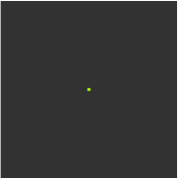

# Creative Coding For Beginners
  
Prof. Dr. Lena Gieseke \| l.gieseke@filmuniversitaet.de  
  

# Exercise 03 - Variables - 30 Points

This session is due on **Tuesday, May 26** before class.  

## Task 03.01 - Slides

Recap the slides:

* [Variables](../../01_slides/ccfb_ss26_06_variables_slides.html)

*Submission*: -

## Task 03.02 - Animation - 15 Points

#### 1. Write a sketch with the following output:

Notes
* The colors are set randomly
* There is no increase of speed for the smaller squares - that is an optical illusion.

#### 2. Change the coloring up to your liking.
  
*Submission*: Add a link to your sketch in your OwnCloud file.

## Task 03.03 - Animation - 15 Points

Create a sketch up to your liking that animates certain properties of the visuals (see the [example from class](https://editor.p5js.org/legie/sketches/pA5Ddli51)). The goal is to practice the use of variables.
  
*Submission*: Add a link to your sketch in your OwnCloud file.

---

*Happy Animating!*
